# fljúga handahófi

Documentation WIP.

### Input dialects

```mermaid
graph TD
    %% High-Level Representations
    subgraph Rust IR
        hir[HIR]
        mir[MIR]
    end

    %% Input Dialects
    subgraph Input Dialects
        affine[Affine]
        arith[Arith]
        async[Async]
        bufferization[Bufferization]
        cf[Control Flow]
        complex[Complex]
        dlti[DLTI]
        func[Func]
        gpu[GPU]
        nvgpu[NVGPU]
        index[Index]
        irdl[IRDL]
        linalg[Linalg]
        math[Math]
        memref[MemRef]
        mesh[Mesh]
        mlprogram[ML Program]
        pdl[PDL]
        pdlinterp[PDL Interp]
        polynomial[Polynomial]
        ptr[Pointer]
        quant[Quant]
        scf[SCF]
        shape[Shape]
        tensor[Tensor]
        tensorops[Tensor Operator Set]
        sparse[Sparse Tensor]
        ub[UB]
    end

    %% Core Transformations
    subgraph Core Transformations
        canonicalization[Canonicalization]
        bufferize[Bufferize]
        legalize[Legalize to Standard]
        lower_to_gpu[Lower to GPU]
        lower_to_scf[Lower to SCF]
        lower_to_affine[Lower to Affine]
        lower_to_linalg[Lower to Linalg]
        lower_to_tensor[Lower to Tensor]
        lower_to_memref[Lower to MemRef]
        lower_to_mlprogram[Lower to ML Program]
        optimize_math[Optimize Math]
        sparse_opt[Sparse Tensor Optimization]
        quantize[Quantize]
    end

    %% Connections between Rust IR and Input Dialects
    hir --> mir

    %% MIR to MLIR Input Dialects
    mir --> func
    mir --> arith
    mir --> scf
    mir --> memref
    mir --> linalg
    mir --> tensor
    mir --> affine
    mir --> cf
    mir --> async
    mir --> gpu
    mir --> math

    %% Connections between Input Dialects and Core Transformations
    affine --> lower_to_affine
    arith --> canonicalization
    async --> bufferize
    bufferization --> bufferize
    cf --> lower_to_scf
    complex --> optimize_math
    dlti --> legalize
    func --> canonicalization
    gpu --> lower_to_gpu
    nvgpu --> lower_to_gpu
    index --> canonicalization
    irdl --> canonicalization
    linalg --> lower_to_linalg
    math --> optimize_math
    memref --> lower_to_memref
    mesh --> lower_to_tensor
    mlprogram --> lower_to_mlprogram
    pdl --> canonicalization
    pdlinterp --> canonicalization
    polynomial --> optimize_math
    ptr --> lower_to_memref
    quant --> quantize
    scf --> lower_to_scf
    shape --> canonicalization
    tensor --> lower_to_tensor
    tensorops --> lower_to_tensor
    sparse --> sparse_opt
    ub --> canonicalization

```

- [affine]()
- [arith]()
- [async]()
- [bufferization]()
- [cf]() 
- [complex]()
- [dlti]()
- [func]()
- [gpu]() 
  [nvgpu]()
- [index]()
- [irdl]() 
- [linalg]()
- [math]() 
- [memref]()
- [mesh]()
- [ML program]()
- [pdl]()
- [pdl interp]()
- [polynomial]()
- [ptr]()
- [quant]()
- [scf]()
- [shape]()
- [tensor]()
- [tensor operator set]()
- [sparse tensor]()
- [ub]()